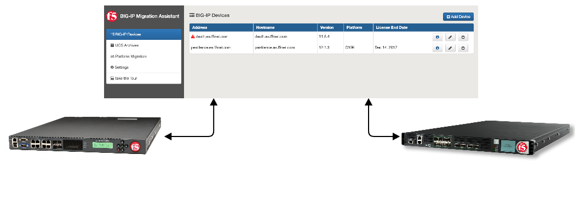

  </img>

# Welcome to the F5 BIG-IP Migration Assistant

[FAQs](FAQ.md)  
[Setup instructions](SETUP.md)  
[Support](SUPPORT.md)

## What is it?

The F5® BIG-IP® Migration Assistant is a tool freely distributed by F5 to facilitate migrating BIG-IP configurations between different platforms. Migration Assistant is a downloadable desktop application that coordinates the logistics required to migrate a BIG-IP configuration from one BIG-IP instance to another.

Migration Assistant migrates a configuration to a new platform. The new platform can be an Amazon Web Services (AWS) instance that spins up in your account during the migration or new BIG-IP hardware.

## Why do I need it?

You can use Migration Assistant when you have an existing BIG-IP instance and you want to replace the current hardware with different hardware, or shift the existing hardware configuration to reside in the AWS ecosystem.

## What does it do?

Migration Assistant does not perform the actual migration; the destination BIG-IP instance performs the actual migration. Configuration migrations depend on a User Configuration Set (UCS) file. UCS files contain all the data needed to back up and restore a BIG-IP instance, and are also used during platform migrations. 

For more information, refer to [K4423: Overview of UCS archives](https://support.f5.com/csp/article/K4423) and [K82540512: Overview of the UCS archive platform-migrate option](https://support.f5.com/csp/article/K82540512).

You can configure multiple UCS files and destination BIG-IP instances, and you can run multiple migrations simultaneously.

##### Migration Assistant performs the following tasks:

1. Pre-migration validation checks
1. UCS generation (for source instance running 12.1.0 and later)
1. Storing and managing UCS files
1. Updating the master key on the source and destination device, if necessary
1. Post-migration validation checks

##### For AWS instances, Migration Assistant also performs the following tasks:

1. Choose the destination instance image type
1. Build out a Virtual Private Cloud (VPC)
1. Spin up other AWS resources required

## How does it work?

Migration Assistant manages the logistics of a configuration migration. Migration Assistant either generates or accepts a UCS file from you, prompts you for a destination BIG-IP instance, and manages the migration.  The destination BIG-IP instance has a [**tmsh**](https://support.f5.com/kb/en-us/products/big-ip_ltm/manuals/product/bigip-tmsh-reference-12-0-0.html) command that performs the migration from a UCS to a running system. Migration Assistant uses this **tmsh** command to accomplish the migration.

Migration Assistant prompts you to enter a source BIG-IP (or upload a UCS file), the master key password, and destination BIG-IP instance. Once the tool obtains this information, it allows you to migrate the source BIG-IP configuration to the destination BIG-IP instance.

## Prerequisites

To use Migration Assistant, the instance you want to migrate **from** _must_ be running 11.1.0 and later, and the instance you want to migrate **to** _must_ be running 12.1.3 or 13.1.0 and later:

|**Source versions supported**|**Target versions supported**|**Notes**|
|---|---|---|
|9.x, 10.x, 11.0.0|Not supported|Not supported due to older versions lacking capabilities required for a migration|
|11.1.0 - 11.6.x|12.1.3 and 13.1.0|You must generate and supply the UCS file manually|
|12.1.0 and later|12.1.3 and 13.1.0|Migration Assistant generates UCS files|

You cannot use this tool to migrate to or from a FIPS-enabled BIG-IP device.

You cannot use this tool to migrate from a BIG-IP device running in Appliance/Common Criteria mode.

If migrating into a vCMP guest, you must configure any needed VLANs in the host prior to attempting to migrate.

## Where do I obtain it?

Download the appropriate installer file from the latest version of Migration Assistant, hosted on [GitHub](https://github.com/f5devcentral/f5-big-ip-migration-assistant/releases).

## What can go wrong?

In some cases, Migration Assistant will not be able to successfully migrate a configuration from the source BIG-IP device to the destination BIG-IP device. Generally when this occurs, the destination BIG-IP device is unable to execute the __tmsh__ command successfully. In this case, Migration Assistant will attempt to roll back the destination BIG-IP configuration.

Migration Assistant will show the output of the **ucs load** command on the BIG-IP device, which may help you to correct issues before you attempt to migrate again.

For more information about limitations of the **platform-migrate** option, which also affects Migration Assistant, refer to [K82540512: Overview of the UCS archive platform-migrate option](https://support.f5.com/csp/article/K82540512).